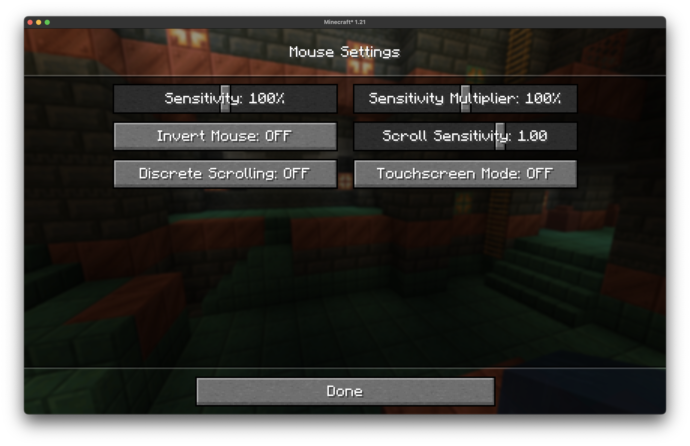

# Mouse Sensitivity Multiplier

A lightweight Minecraft mod that applies a customizable multiplier to your existing mouse sensitivity settings.

## Overview

This mod allows you to fine-tune your mouse sensitivity beyond Minecraft's built-in sensitivity slider by applying a multiplier to your current sensitivity setting. Instead of replacing the vanilla sensitivity system, it works alongside it to give you more precise control over your mouse movement.

## Why This Mod is Useful

### DPI-Related Benefits

**High DPI Mouse Users**: If you have a gaming mouse with high DPI (1600+ DPI), Minecraft's lowest sensitivity setting might still feel too fast for precise building or PvP. This mod lets you scale down your sensitivity further without having to constantly adjust your mouse's hardware DPI settings.

**Low DPI Mouse Users**: Conversely, if you're using an older mouse or one with lower DPI (400-800 DPI), you might find that even Minecraft's maximum sensitivity feels sluggish. The multiplier can boost your effective sensitivity beyond the vanilla limit.

## Screenshot

## Installation

1. Install Fabric (depending on mod version)
2. Download the mod jar file
3. Place it in your `mods` folder
4. Launch Minecraft

## Compatibility

- Minecraft versions: 1.21.x
- Fabric

## License

This mod is released under the MIT License.